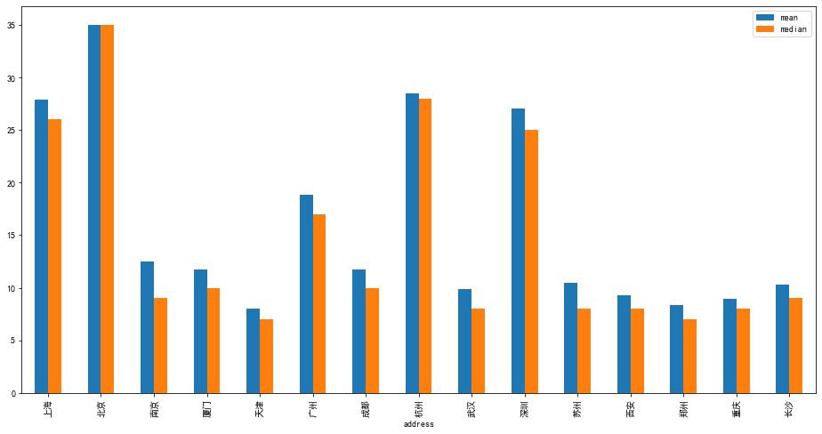
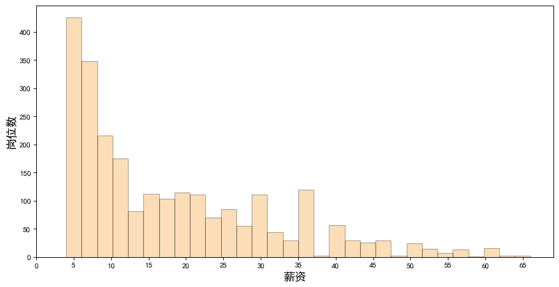
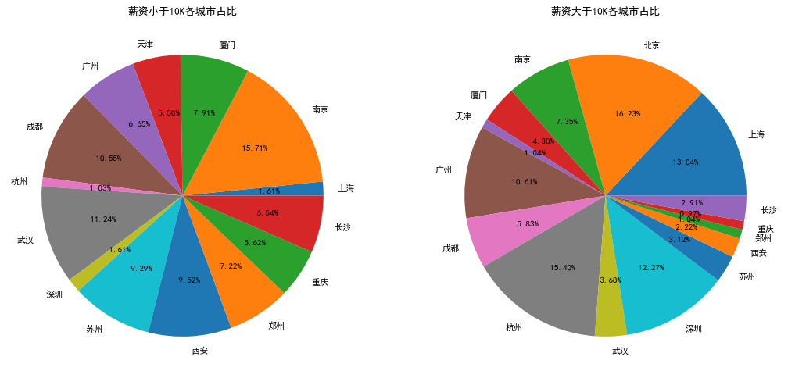
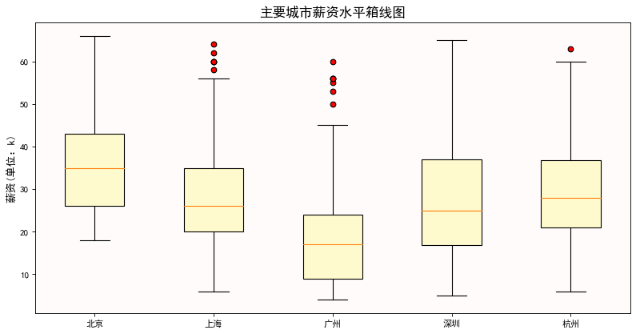
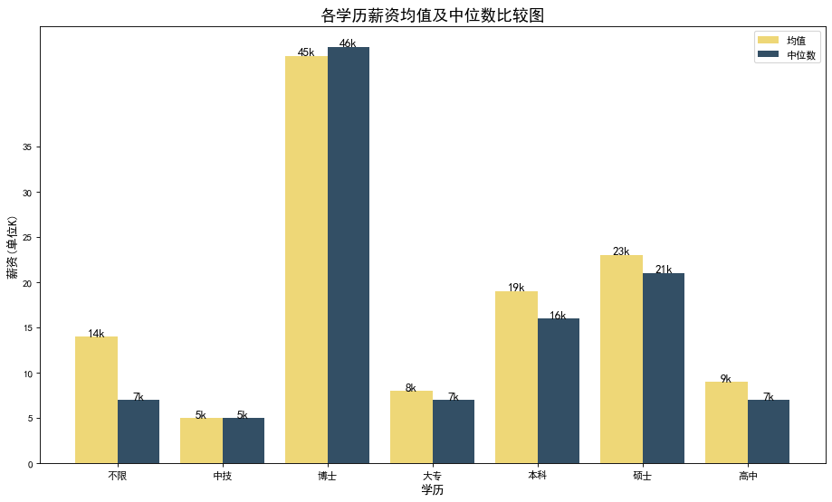
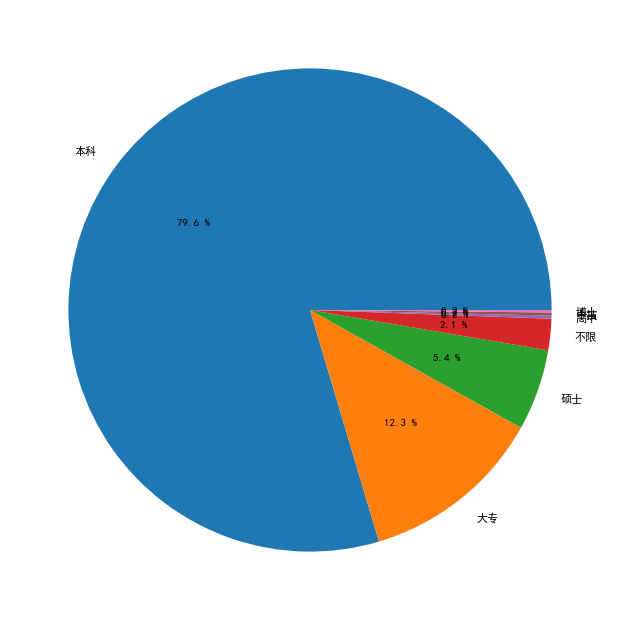
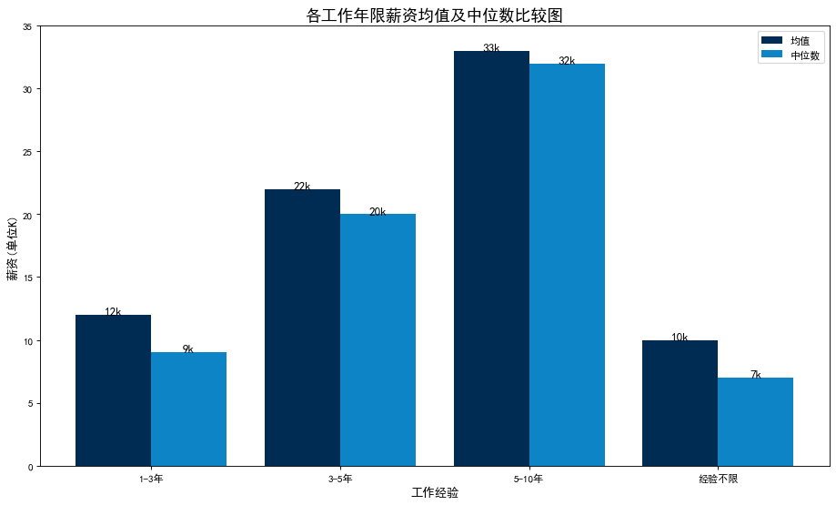
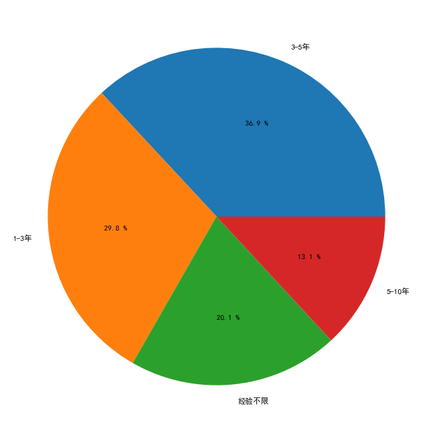
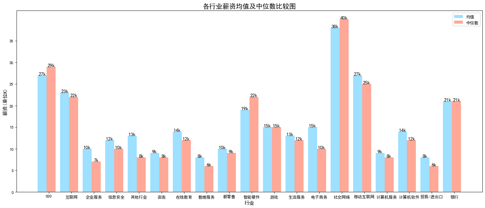
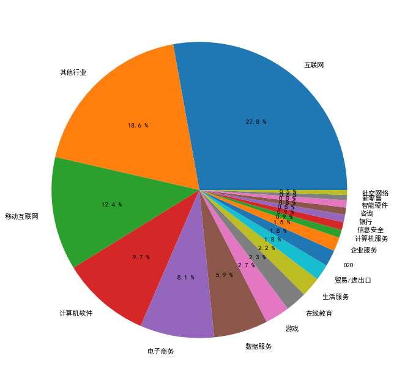

```python
import numpy as np
import pandas as pd
import matplotlib.pyplot as plt
import warnings 
from scipy.stats import norm,mode
import re
from wordcloud import WordCloud
plt.rcParams['font.sans-serif']=['SimHei']
plt.rcParams['axes.unicode_minus']=False
warnings.filterwarnings('ignore')
```

#读取csv，并且添加header


```python
df = pd.read_csv('boss.csv',header=None,names=['company','position','address','salary','requires','lables','tags'])
df.head()
```

<table border="1" class="dataframe">
  <thead>
    <tr style="text-align: right;">
      <th></th>
      <th>company</th>
      <th>position</th>
      <th>address</th>
      <th>salary</th>
      <th>requires</th>
      <th>lables</th>
      <th>tags</th>
    </tr>
  </thead>
  <tbody>
    <tr>
      <th>0</th>
      <td>安存科技</td>
      <td>数据分析师</td>
      <td>长沙</td>
      <td>9-14K</td>
      <td>1-3年本科</td>
      <td>计算机软件</td>
      <td>数据挖掘,大数据,工业数据,模型产品,特征工程</td>
    </tr>
    <tr>
      <th>1</th>
      <td>名利天下</td>
      <td>数据分析师</td>
      <td>长沙</td>
      <td>2-3K</td>
      <td>经验不限学历不限</td>
      <td>移动互联网</td>
      <td>数据挖掘,数据分析师,店铺运营管理,战略目标,策划</td>
    </tr>
    <tr>
      <th>2</th>
      <td>长沙沃邦</td>
      <td>数据分析师</td>
      <td>长沙</td>
      <td>5-10K</td>
      <td>经验不限大专</td>
      <td>企业服务</td>
      <td>SPSS,VBA,建模,数据分析师,统计学</td>
    </tr>
    <tr>
      <th>3</th>
      <td>谊品</td>
      <td>数据分析师</td>
      <td>长沙</td>
      <td>3-8K</td>
      <td>3-5年大专</td>
      <td>其他服务业</td>
      <td>Python,SQL,数据分析师,数据分析管理,</td>
    </tr>
    <tr>
      <th>4</th>
      <td>众美健康</td>
      <td>数据分析师</td>
      <td>长沙</td>
      <td>10-15K</td>
      <td>经验不限本科</td>
      <td>计算机软件</td>
      <td>大数据,数据挖掘,数据仓库,商业数据分析,数据分析师</td>
    </tr>
  </tbody>
</table>


```python
df.info
```


    <bound method DataFrame.info of      company      position address    salary  requires lables  \
    0       安存科技         数据分析师      长沙     9-14K    1-3年本科  计算机软件   
    1       名利天下         数据分析师      长沙      2-3K  经验不限学历不限  移动互联网   
    2       长沙沃邦         数据分析师      长沙     5-10K    经验不限大专   企业服务   
    3         谊品         数据分析师      长沙      3-8K    3-5年大专  其他服务业   
    4       众美健康         数据分析师      长沙    10-15K    经验不限本科  计算机软件   
    ...      ...           ...     ...       ...       ...    ...   
    2532    今日头条         数据分析师      西安  6-8K·15薪    1-3年本科  移动互联网   
    2533     众科源  7k起急招运营数据分析师      西安     7-10K    经验不限本科   电子商务   
    2534    今日头条         数据分析师      西安  6-8K·15薪    1-3年本科  移动互联网   
    2535    今日头条         数据分析师      西安  4-6K·15薪    经验不限本科  移动互联网   
    2536    今日头条         数据分析师      西安  4-6K·15薪    经验不限本科  移动互联网   
    
                                        tags  
    0                数据挖掘,大数据,工业数据,模型产品,特征工程  
    1              数据挖掘,数据分析师,店铺运营管理,战略目标,策划  
    2                  SPSS,VBA,建模,数据分析师,统计学  
    3               Python,SQL,数据分析师,数据分析管理,  
    4             大数据,数据挖掘,数据仓库,商业数据分析,数据分析师  
    ...                                  ...  
    2532     Tableau，数据挖掘，BI，行业技术发展，心理学等相关专业  
    2533              数学，统计学，运营数据分析，亚马逊，电商平台  
    2534  Tableau，数据挖掘，行业技术发展，心理学等相关专业，数据分析师  
    2535         数据挖掘，Python，数据分析师，业务数据，风险报告  
    2536         数据挖掘，Python，数据开发，数据分析师，业务数据  
    
    [2537 rows x 7 columns]>


```python
df.shape
```


    (2537, 7)


#去重


```python
df.duplicated().sum()
```


    11


```python
df.drop_duplicates(keep='first',inplace=True)
```


```python
df.duplicated().sum()
```


    0


```python
df.shape
```


    (2526, 7)


#因为实习的薪资和全职计算不一样，所以去掉含有‘实习’的行，以方便统计


```python
x=df['position'].str.contains('实习')
df=df[~x]
df.reset_index(drop=True,inplace=True)
```


```python
df.shape
```


    (2472, 7)


#查看address字段是否需要清洗


```python
df['address'].unique()
```


    array(['长沙', '成都', '郑州', '重庆', '南京', '武汉', '厦门', '杭州', '北京', '广州', '上海',
           '深圳', '苏州', '天津', '西安'], dtype=object)


#address可以使用，查看salary字段


```python
df['salary'].unique()
```


    array(['9-14K', '2-3K', '5-10K', '3-8K', '10-15K', '8-13K', '5-6K',
           '10-15K·15薪', '8-10K·14薪', '7-9K', '10-15K·13薪', '5-9K', '5-8K',
           '6-10K', '8-12K', '5-7K', '15-20K', '4-7K', '30-50K·14薪', '4-6K',
           '3-7K', '10-15K·14薪', '7-8K', '4-5K', '11-18K', '12-17K·15薪',
           '11-12K', '7-12K', '20-25K', '7-12K·13薪', '8-13K·13薪',
           '15-25K·16薪', '4-9K', '8-10K', '4-8K', '3-6K', '12-20K', '10-11K',
           '12-24K', '3-4K', '6-7K', '6-8K', '8-12K·13薪', '6-10K·13薪',
           '8-11K', '12-15K·13薪', '3-5K·14薪', '6-11K', '8-15K', '10-11K·16薪',
           '15-30K·16薪', '2-7K', '15-20K·13薪', '15-30K', '10-13K·13薪',
           '18-35K', '12-16K·13薪', '3-5K', '12-18K·14薪', '11-22K', '14-20K',
           '8-12K·15薪', '10-12K·15薪', '12-24K·13薪', '8-13K·15薪', '12-18K',
           '15-25K', '20-30K·13薪', '7-10K', '11-20K·14薪', '18-35K·13薪',
           '20-40K', '11-16K·13薪', '12-14K', '11-14K·13薪', '4-8K·13薪', '6-9K',
           '25-35K·15薪', '15-28K·13薪', '11-20K', '8-12K·14薪', '20-30K·16薪',
           '5-10K·13薪', '7-14K', '10-20K', '10-13K', '12-15K', '7-11K',
           '6-9K·13薪', '12-17K', '4-6K·15薪', '15-20K·14薪', '11-13K·13薪',
           '8-16K', '9-14K·13薪', '10-11K·14薪', '15-16K', '20-40K·18薪',
           '9-13K·13薪', '11-18K·14薪', '8-13K·14薪', '15-25K·13薪', '22-40K',
           '20-40K·15薪', '26-50K', '15-30K·14薪', '13-26K', '20-35K', '25-50K',
           '11-18K·13薪', '20-35K·14薪', '8-10K·13薪', '9-10K', '4-6K·13薪',
           '20-40K·14薪', '2-4K', '1-4K', '6-8K·13薪', '7-9K·14薪', '11-20K·13薪',
           '7-10K·14薪', '5-8K·13薪', '4-7K·13薪', '7-11K·13薪', '14-25K·14薪',
           '20-30K', '20-25K·19薪', '30-60K', '15-30K·13薪', '12-22K', '13-18K',
           '15-28K', '17-28K·15薪', '13-25K', '17-34K', '30-45K', '15-25K·14薪',
           '25-35K', '4-9K·14薪', '20-40K·16薪', '11-22K·14薪', '5-10K·14薪',
           '12-20K·13薪', '18-28K', '30-50K·13薪', '14-25K', '18-25K·14薪',
           '6-8K·14薪', '5-9K·13薪', '6-9K·14薪', '15-30K·15薪', '19-35K',
           '7-10K·13薪', '13-20K·13薪', '40-70K', '9-14K·14薪', '9-13K',
           '12-24K·14薪', '15-18K·13薪', '35-70K', '8-9K', '11-22K·13薪',
           '30-40K', '17-30K', '11-17K', '18-35K·14薪', '4-6K·14薪', '7-8K·13薪',
           '18-30K·14薪', '4-5K·14薪', '10-12K', '6-11K·14薪', '6-12K',
           '4-5K·13薪', '7-12K·14薪', '1-5K', '18-19K', '13-20K', '5-8K·15薪',
           '6-10K·14薪', '12-13K·15薪', '11-18K·15薪', '9-12K', '11-16K',
           '15-22K·13薪', '18-30K·13薪', '13-25K·13薪', '25-40K', '5-10K·15薪',
           '13-20K·15薪', '5-6K·13薪', '12-18K·13薪', '10-20K·18薪', '2-6K',
           '12-20K·14薪', '15-22K', '15-16K·13薪', '30-60K·16薪', '30-50K·15薪',
           '13-21K·13薪', '20-24K', '17-28K', '25-45K·15薪', '17-25K',
           '25-50K·16薪', '20-21K·16薪', '17-25K·13薪', '15-25K·15薪',
           '16-25K·14薪', '30-45K·16薪', '20-35K·15薪', '20-30K·15薪',
           '20-27K·15薪', '50-80K·16薪', '22-27K', '28-50K·13薪', '18-30K',
           '16-30K·14薪', '25-45K', '20-30K·14薪', '15-30K·17薪', '13-25K·14薪',
           '18-27K', '20-40K·13薪', '18-36K', '20-35K·16薪', '25-35K·13薪',
           '25-30K·15薪', '25-30K', '28-40K·14薪', '25-45K·16薪', '25-50K·14薪',
           '15-25K·17薪', '25-40K·16薪', '35-40K', '10-15K·16薪', '6-10K·15薪',
           '20-35K·13薪', '19-32K·16薪', '30-50K·16薪', '25-30K·14薪',
           '7-11K·15薪', '40-70K·16薪', '25-40K·15薪', '30-55K·18薪',
           '25-35K·14薪', '18-25K', '16-30K', '12-18K·15薪', '30-50K',
           '30-50K·18薪', '30-35K·16薪', '25-45K·14薪', '12-20K·17薪',
           '12-20K·15薪', '14-28K', '30-55K', '60-90K', '25-40K·13薪', '65-95K',
           '25-50K·13薪', '16-30K·16薪', '24-38K', '45-60K', '26-35K',
           '18-35K·16薪', '30-45K·15薪', '25-50K·15薪', '25-45K·13薪',
           '30-55K·13薪', '50-80K·14薪', '40-55K·13薪', '19-30K·14薪', '22-30K',
           '35-55K·14薪', '21-40K·15薪', '17-25K·15薪', '15-26K', '35-60K·14薪',
           '18-35K·15薪', '30-40K·16薪', '30-60K·15薪', '30-55K·16薪',
           '28-40K·16薪', '90-120K·14薪', '35-55K·16薪', '20-25K·15薪',
           '20-40K·24薪', '40-50K·15薪', '25-35K·16薪', '25-40K·14薪',
           '35-65K·16薪', '30-45K·14薪', '40-65K·14薪', '28-45K·14薪',
           '30-60K·14薪', '22-40K·14薪', '28-45K·16薪', '18-25K·16薪',
           '9-14K·16薪', '15-23K', '60-90K·16薪', '12-24K·16薪', '15-23K·13薪',
           '12-20K·16薪', '13-18K·15薪', '11-20K·15薪', '9-12K·15薪',
           '10-13K·14薪', '18-28K·16薪', '23-24K', '25-50K·18薪', '35-50K',
           '18-28K·13薪', '15-17K', '8-11K·13薪', '15-18K', '12-17K·14薪',
           '16-23K', '30-35K', '13-23K', '14-28K·13薪', '40-60K', '16-22K·13薪',
           '14-20K·13薪', '15-26K·13薪', '30-35K·15薪', '18-30K·15薪',
           '12-22K·22薪', '18-25K·15薪', '28-35K·13薪', '40-60K·14薪',
           '18-25K·13薪', '20-21K·14薪', '12-23K·13薪', '40-70K·14薪',
           '25-50K·17薪', '25-30K·13薪', '15-23K·14薪', '18-26K', '16-25K·13薪',
           '7-10K·16薪', '12-18K·16薪', '13-18K·14薪', '15-20K·15薪', '7-9K·13薪',
           '30-40K·14薪', '28-40K·15薪', '40-60K·15薪', '14-28K·14薪',
           '15-30K·18薪', '16-25K', '12-16K·15薪', '30-55K·15薪', '12-20K·18薪',
           '8-9K·13薪', '12-19K·13薪', '15-24K·15薪', '20-21K', '17-18K',
           '50-80K', '13-26K·16薪', '16-30K·15薪', '11-22K·18薪', '30-60K·13薪',
           '35-50K·15薪', '35-50K·16薪', '18-22K', '28-45K', '23-45K·16薪',
           '13-16K', '16-21K·14薪', '11-16K·14薪', '6-11K·13薪', '6-7K·13薪',
           '5-7K·13薪', '2-5K', '11-15K', '9-15K', '8-14K', '5-8K·14薪',
           '3-5K·13薪', '6-8K·15薪', '6-9K·15薪', '6-11K·15薪'], dtype=object)


#将薪资列的值进行拆分，新增bottom，top两列，作为一个岗位薪资的最低值和最高值，单值的，用button填充top


```python
df['bottom']=df['salary'].str.extract('^(\d+).*')
df['top']=df['salary'].str.extract('^.*?-(\d+).*')
df['top'].fillna(df['bottom'],inplace=True)
df
```

<table border="1" class="dataframe">
  <thead>
    <tr style="text-align: right;">
      <th></th>
      <th>company</th>
      <th>position</th>
      <th>address</th>
      <th>salary</th>
      <th>requires</th>
      <th>lables</th>
      <th>tags</th>
      <th>bottom</th>
      <th>top</th>
    </tr>
  </thead>
  <tbody>
    <tr>
      <th>0</th>
      <td>安存科技</td>
      <td>数据分析师</td>
      <td>长沙</td>
      <td>9-14K</td>
      <td>1-3年本科</td>
      <td>计算机软件</td>
      <td>数据挖掘,大数据,工业数据,模型产品,特征工程</td>
      <td>9</td>
      <td>14</td>
    </tr>
    <tr>
      <th>1</th>
      <td>名利天下</td>
      <td>数据分析师</td>
      <td>长沙</td>
      <td>2-3K</td>
      <td>经验不限学历不限</td>
      <td>移动互联网</td>
      <td>数据挖掘,数据分析师,店铺运营管理,战略目标,策划</td>
      <td>2</td>
      <td>3</td>
    </tr>
    <tr>
      <th>2</th>
      <td>长沙沃邦</td>
      <td>数据分析师</td>
      <td>长沙</td>
      <td>5-10K</td>
      <td>经验不限大专</td>
      <td>企业服务</td>
      <td>SPSS,VBA,建模,数据分析师,统计学</td>
      <td>5</td>
      <td>10</td>
    </tr>
    <tr>
      <th>3</th>
      <td>谊品</td>
      <td>数据分析师</td>
      <td>长沙</td>
      <td>3-8K</td>
      <td>3-5年大专</td>
      <td>其他服务业</td>
      <td>Python,SQL,数据分析师,数据分析管理,</td>
      <td>3</td>
      <td>8</td>
    </tr>
    <tr>
      <th>4</th>
      <td>众美健康</td>
      <td>数据分析师</td>
      <td>长沙</td>
      <td>10-15K</td>
      <td>经验不限本科</td>
      <td>计算机软件</td>
      <td>大数据,数据挖掘,数据仓库,商业数据分析,数据分析师</td>
      <td>10</td>
      <td>15</td>
    </tr>
    <tr>
      <th>...</th>
      <td>...</td>
      <td>...</td>
      <td>...</td>
      <td>...</td>
      <td>...</td>
      <td>...</td>
      <td>...</td>
      <td>...</td>
      <td>...</td>
    </tr>
    <tr>
      <th>2467</th>
      <td>今日头条</td>
      <td>数据分析师</td>
      <td>西安</td>
      <td>6-8K·15薪</td>
      <td>1-3年本科</td>
      <td>移动互联网</td>
      <td>Tableau，数据挖掘，BI，行业技术发展，心理学等相关专业</td>
      <td>6</td>
      <td>8</td>
    </tr>
    <tr>
      <th>2468</th>
      <td>众科源</td>
      <td>7k起急招运营数据分析师</td>
      <td>西安</td>
      <td>7-10K</td>
      <td>经验不限本科</td>
      <td>电子商务</td>
      <td>数学，统计学，运营数据分析，亚马逊，电商平台</td>
      <td>7</td>
      <td>10</td>
    </tr>
    <tr>
      <th>2469</th>
      <td>今日头条</td>
      <td>数据分析师</td>
      <td>西安</td>
      <td>6-8K·15薪</td>
      <td>1-3年本科</td>
      <td>移动互联网</td>
      <td>Tableau，数据挖掘，行业技术发展，心理学等相关专业，数据分析师</td>
      <td>6</td>
      <td>8</td>
    </tr>
    <tr>
      <th>2470</th>
      <td>今日头条</td>
      <td>数据分析师</td>
      <td>西安</td>
      <td>4-6K·15薪</td>
      <td>经验不限本科</td>
      <td>移动互联网</td>
      <td>数据挖掘，Python，数据分析师，业务数据，风险报告</td>
      <td>4</td>
      <td>6</td>
    </tr>
    <tr>
      <th>2471</th>
      <td>今日头条</td>
      <td>数据分析师</td>
      <td>西安</td>
      <td>4-6K·15薪</td>
      <td>经验不限本科</td>
      <td>移动互联网</td>
      <td>数据挖掘，Python，数据开发，数据分析师，业务数据</td>
      <td>4</td>
      <td>6</td>
    </tr>
  </tbody>
</table>
<p>2472 rows × 9 columns</p>
</div>


#有些公司标注1X薪等，故新增一列commission_pct计算每个岗位的奖金率


```python
df['commision_pct']=df['salary'].str.extract('^.*?·(\d{2})薪')
df['commision_pct'].fillna(12,inplace=True)
df['commision_pct']=df['commision_pct'].astype('float64')
df['commision_pct']=df['commision_pct']/12
```

#把bottom，top，commission__pct列转换为数值，计算出每个岗位的平均薪资avg_salary


```python
df['bottom'] = df['bottom'].astype('int64')
df['top'] = df['top'].astype('int64')
df['avg_salary'] = (df['bottom']+df['top'])/2*df['commision_pct']
df['avg_salary'] = df['avg_salary'].astype('int64')

cols=list(df)
cols.insert(4,cols.pop(cols.index('bottom')))
cols.insert(5,cols.pop(cols.index('top')))
cols.insert(6,cols.pop(cols.index('commision_pct')))
cols.insert(7,cols.pop(cols.index('avg_salary')))
df=df.loc[:,cols]
df
```


<div>
<style scoped>
    .dataframe tbody tr th:only-of-type {
        vertical-align: middle;
    }

    .dataframe tbody tr th {
        vertical-align: top;
    }
    
    .dataframe thead th {
        text-align: right;
    }
</style>
<table border="1" class="dataframe">
  <thead>
    <tr style="text-align: right;">
      <th></th>
      <th>company</th>
      <th>position</th>
      <th>address</th>
      <th>salary</th>
      <th>bottom</th>
      <th>top</th>
      <th>commision_pct</th>
      <th>avg_salary</th>
      <th>requires</th>
      <th>lables</th>
      <th>tags</th>
    </tr>
  </thead>
  <tbody>
    <tr>
      <th>0</th>
      <td>安存科技</td>
      <td>数据分析师</td>
      <td>长沙</td>
      <td>9-14K</td>
      <td>9</td>
      <td>14</td>
      <td>1.00</td>
      <td>11</td>
      <td>1-3年本科</td>
      <td>计算机软件</td>
      <td>数据挖掘,大数据,工业数据,模型产品,特征工程</td>
    </tr>
    <tr>
      <th>1</th>
      <td>名利天下</td>
      <td>数据分析师</td>
      <td>长沙</td>
      <td>2-3K</td>
      <td>2</td>
      <td>3</td>
      <td>1.00</td>
      <td>2</td>
      <td>经验不限学历不限</td>
      <td>移动互联网</td>
      <td>数据挖掘,数据分析师,店铺运营管理,战略目标,策划</td>
    </tr>
    <tr>
      <th>2</th>
      <td>长沙沃邦</td>
      <td>数据分析师</td>
      <td>长沙</td>
      <td>5-10K</td>
      <td>5</td>
      <td>10</td>
      <td>1.00</td>
      <td>7</td>
      <td>经验不限大专</td>
      <td>企业服务</td>
      <td>SPSS,VBA,建模,数据分析师,统计学</td>
    </tr>
    <tr>
      <th>3</th>
      <td>谊品</td>
      <td>数据分析师</td>
      <td>长沙</td>
      <td>3-8K</td>
      <td>3</td>
      <td>8</td>
      <td>1.00</td>
      <td>5</td>
      <td>3-5年大专</td>
      <td>其他服务业</td>
      <td>Python,SQL,数据分析师,数据分析管理,</td>
    </tr>
    <tr>
      <th>4</th>
      <td>众美健康</td>
      <td>数据分析师</td>
      <td>长沙</td>
      <td>10-15K</td>
      <td>10</td>
      <td>15</td>
      <td>1.00</td>
      <td>12</td>
      <td>经验不限本科</td>
      <td>计算机软件</td>
      <td>大数据,数据挖掘,数据仓库,商业数据分析,数据分析师</td>
    </tr>
    <tr>
      <th>...</th>
      <td>...</td>
      <td>...</td>
      <td>...</td>
      <td>...</td>
      <td>...</td>
      <td>...</td>
      <td>...</td>
      <td>...</td>
      <td>...</td>
      <td>...</td>
      <td>...</td>
    </tr>
    <tr>
      <th>2467</th>
      <td>今日头条</td>
      <td>数据分析师</td>
      <td>西安</td>
      <td>6-8K·15薪</td>
      <td>6</td>
      <td>8</td>
      <td>1.25</td>
      <td>8</td>
      <td>1-3年本科</td>
      <td>移动互联网</td>
      <td>Tableau，数据挖掘，BI，行业技术发展，心理学等相关专业</td>
    </tr>
    <tr>
      <th>2468</th>
      <td>众科源</td>
      <td>7k起急招运营数据分析师</td>
      <td>西安</td>
      <td>7-10K</td>
      <td>7</td>
      <td>10</td>
      <td>1.00</td>
      <td>8</td>
      <td>经验不限本科</td>
      <td>电子商务</td>
      <td>数学，统计学，运营数据分析，亚马逊，电商平台</td>
    </tr>
    <tr>
      <th>2469</th>
      <td>今日头条</td>
      <td>数据分析师</td>
      <td>西安</td>
      <td>6-8K·15薪</td>
      <td>6</td>
      <td>8</td>
      <td>1.25</td>
      <td>8</td>
      <td>1-3年本科</td>
      <td>移动互联网</td>
      <td>Tableau，数据挖掘，行业技术发展，心理学等相关专业，数据分析师</td>
    </tr>
    <tr>
      <th>2470</th>
      <td>今日头条</td>
      <td>数据分析师</td>
      <td>西安</td>
      <td>4-6K·15薪</td>
      <td>4</td>
      <td>6</td>
      <td>1.25</td>
      <td>6</td>
      <td>经验不限本科</td>
      <td>移动互联网</td>
      <td>数据挖掘，Python，数据分析师，业务数据，风险报告</td>
    </tr>
    <tr>
      <th>2471</th>
      <td>今日头条</td>
      <td>数据分析师</td>
      <td>西安</td>
      <td>4-6K·15薪</td>
      <td>4</td>
      <td>6</td>
      <td>1.25</td>
      <td>6</td>
      <td>经验不限本科</td>
      <td>移动互联网</td>
      <td>数据挖掘，Python，数据开发，数据分析师，业务数据</td>
    </tr>
  </tbody>
</table>
<p>2472 rows × 11 columns</p>
</div>


```python
df.describe()
```


<div>
<style scoped>
    .dataframe tbody tr th:only-of-type {
        vertical-align: middle;
    }

    .dataframe tbody tr th {
        vertical-align: top;
    }
    
    .dataframe thead th {
        text-align: right;
    }
</style>
<table border="1" class="dataframe">
  <thead>
    <tr style="text-align: right;">
      <th></th>
      <th>bottom</th>
      <th>top</th>
      <th>commision_pct</th>
      <th>avg_salary</th>
    </tr>
  </thead>
  <tbody>
    <tr>
      <th>count</th>
      <td>2472.000000</td>
      <td>2472.000000</td>
      <td>2472.000000</td>
      <td>2472.000000</td>
    </tr>
    <tr>
      <th>mean</th>
      <td>12.621764</td>
      <td>21.355178</td>
      <td>1.067894</td>
      <td>18.395227</td>
    </tr>
    <tr>
      <th>std</th>
      <td>8.410919</td>
      <td>15.055249</td>
      <td>0.111316</td>
      <td>13.952061</td>
    </tr>
    <tr>
      <th>min</th>
      <td>1.000000</td>
      <td>3.000000</td>
      <td>1.000000</td>
      <td>2.000000</td>
    </tr>
    <tr>
      <th>25%</th>
      <td>6.000000</td>
      <td>9.000000</td>
      <td>1.000000</td>
      <td>7.000000</td>
    </tr>
    <tr>
      <th>50%</th>
      <td>10.000000</td>
      <td>15.000000</td>
      <td>1.000000</td>
      <td>13.000000</td>
    </tr>
    <tr>
      <th>75%</th>
      <td>18.000000</td>
      <td>30.000000</td>
      <td>1.083333</td>
      <td>26.000000</td>
    </tr>
    <tr>
      <th>max</th>
      <td>90.000000</td>
      <td>120.000000</td>
      <td>2.000000</td>
      <td>122.000000</td>
    </tr>
  </tbody>
</table>
</div>


#去掉一些极端值，这里设置平均值为3k-70k


```python
df=df[(df.avg_salary>3)&(df.avg_salary<70)]
df.describe()
```


<div>
<style scoped>
    .dataframe tbody tr th:only-of-type {
        vertical-align: middle;
    }

    .dataframe tbody tr th {
        vertical-align: top;
    }
    
    .dataframe thead th {
        text-align: right;
    }
</style>
<table border="1" class="dataframe">
  <thead>
    <tr style="text-align: right;">
      <th></th>
      <th>bottom</th>
      <th>top</th>
      <th>commision_pct</th>
      <th>avg_salary</th>
    </tr>
  </thead>
  <tbody>
    <tr>
      <th>count</th>
      <td>2432.000000</td>
      <td>2432.000000</td>
      <td>2432.000000</td>
      <td>2432.000000</td>
    </tr>
    <tr>
      <th>mean</th>
      <td>12.534951</td>
      <td>21.247122</td>
      <td>1.067914</td>
      <td>18.257401</td>
    </tr>
    <tr>
      <th>std</th>
      <td>7.836120</td>
      <td>14.377763</td>
      <td>0.111021</td>
      <td>13.180500</td>
    </tr>
    <tr>
      <th>min</th>
      <td>2.000000</td>
      <td>5.000000</td>
      <td>1.000000</td>
      <td>4.000000</td>
    </tr>
    <tr>
      <th>25%</th>
      <td>6.000000</td>
      <td>10.000000</td>
      <td>1.000000</td>
      <td>7.000000</td>
    </tr>
    <tr>
      <th>50%</th>
      <td>10.000000</td>
      <td>15.000000</td>
      <td>1.000000</td>
      <td>14.000000</td>
    </tr>
    <tr>
      <th>75%</th>
      <td>18.000000</td>
      <td>30.000000</td>
      <td>1.083333</td>
      <td>26.000000</td>
    </tr>
    <tr>
      <th>max</th>
      <td>50.000000</td>
      <td>80.000000</td>
      <td>2.000000</td>
      <td>66.000000</td>
    </tr>
  </tbody>
</table>
</div>


#观察requests


```python
df['requires'].unique()
```


    array(['1-3年本科', '经验不限大专', '3-5年大专', '经验不限本科', '3-5年本科', '1-3年硕士',
           '1-3年大专', '1年以内大专', '5-10年本科', '1-3年学历不限', '1年以内本科', '在校/应届本科',
           '5-10年大专', '3-5年硕士', '1年以内学历不限', '经验不限学历不限', '1年以内硕士', '1年以内高中',
           '5-10年硕士', '1-3年高中', '在校/应届大专', '经验不限中专/中技', '经验不限硕士', '1-3年中专/中技',
           '在校/应届硕士', '10年以上本科', '3-5年学历不限', '1-3年博士', '5-10年学历不限', '5-10年博士',
           '经验不限博士', '经验不限高中', '10年以上硕士'], dtype=object)


#将经验需求拆分出来放入experience字段，学历要求放入diploma字段


```python
df['experience']=df['requires'].str.extract('^(\d+/?-\d+)')
df['diploma']=df['requires'].str[-2:]
df
```


<div>
<style scoped>
    .dataframe tbody tr th:only-of-type {
        vertical-align: middle;
    }

    .dataframe tbody tr th {
        vertical-align: top;
    }
    
    .dataframe thead th {
        text-align: right;
    }
</style>
<table border="1" class="dataframe">
  <thead>
    <tr style="text-align: right;">
      <th></th>
      <th>company</th>
      <th>position</th>
      <th>address</th>
      <th>salary</th>
      <th>bottom</th>
      <th>top</th>
      <th>commision_pct</th>
      <th>avg_salary</th>
      <th>requires</th>
      <th>lables</th>
      <th>tags</th>
      <th>experience</th>
      <th>diploma</th>
    </tr>
  </thead>
  <tbody>
    <tr>
      <th>0</th>
      <td>安存科技</td>
      <td>数据分析师</td>
      <td>长沙</td>
      <td>9-14K</td>
      <td>9</td>
      <td>14</td>
      <td>1.00</td>
      <td>11</td>
      <td>1-3年本科</td>
      <td>计算机软件</td>
      <td>数据挖掘,大数据,工业数据,模型产品,特征工程</td>
      <td>1-3</td>
      <td>本科</td>
    </tr>
    <tr>
      <th>2</th>
      <td>长沙沃邦</td>
      <td>数据分析师</td>
      <td>长沙</td>
      <td>5-10K</td>
      <td>5</td>
      <td>10</td>
      <td>1.00</td>
      <td>7</td>
      <td>经验不限大专</td>
      <td>企业服务</td>
      <td>SPSS,VBA,建模,数据分析师,统计学</td>
      <td>NaN</td>
      <td>大专</td>
    </tr>
    <tr>
      <th>3</th>
      <td>谊品</td>
      <td>数据分析师</td>
      <td>长沙</td>
      <td>3-8K</td>
      <td>3</td>
      <td>8</td>
      <td>1.00</td>
      <td>5</td>
      <td>3-5年大专</td>
      <td>其他服务业</td>
      <td>Python,SQL,数据分析师,数据分析管理,</td>
      <td>3-5</td>
      <td>大专</td>
    </tr>
    <tr>
      <th>4</th>
      <td>众美健康</td>
      <td>数据分析师</td>
      <td>长沙</td>
      <td>10-15K</td>
      <td>10</td>
      <td>15</td>
      <td>1.00</td>
      <td>12</td>
      <td>经验不限本科</td>
      <td>计算机软件</td>
      <td>大数据,数据挖掘,数据仓库,商业数据分析,数据分析师</td>
      <td>NaN</td>
      <td>本科</td>
    </tr>
    <tr>
      <th>5</th>
      <td>百川创意</td>
      <td>数据分析工程师</td>
      <td>长沙</td>
      <td>8-13K</td>
      <td>8</td>
      <td>13</td>
      <td>1.00</td>
      <td>10</td>
      <td>1-3年本科</td>
      <td>互联网</td>
      <td>分配策略,数据分析工程师,业务发展趋势,业务分析,渠道</td>
      <td>1-3</td>
      <td>本科</td>
    </tr>
    <tr>
      <th>...</th>
      <td>...</td>
      <td>...</td>
      <td>...</td>
      <td>...</td>
      <td>...</td>
      <td>...</td>
      <td>...</td>
      <td>...</td>
      <td>...</td>
      <td>...</td>
      <td>...</td>
      <td>...</td>
      <td>...</td>
    </tr>
    <tr>
      <th>2467</th>
      <td>今日头条</td>
      <td>数据分析师</td>
      <td>西安</td>
      <td>6-8K·15薪</td>
      <td>6</td>
      <td>8</td>
      <td>1.25</td>
      <td>8</td>
      <td>1-3年本科</td>
      <td>移动互联网</td>
      <td>Tableau，数据挖掘，BI，行业技术发展，心理学等相关专业</td>
      <td>1-3</td>
      <td>本科</td>
    </tr>
    <tr>
      <th>2468</th>
      <td>众科源</td>
      <td>7k起急招运营数据分析师</td>
      <td>西安</td>
      <td>7-10K</td>
      <td>7</td>
      <td>10</td>
      <td>1.00</td>
      <td>8</td>
      <td>经验不限本科</td>
      <td>电子商务</td>
      <td>数学，统计学，运营数据分析，亚马逊，电商平台</td>
      <td>NaN</td>
      <td>本科</td>
    </tr>
    <tr>
      <th>2469</th>
      <td>今日头条</td>
      <td>数据分析师</td>
      <td>西安</td>
      <td>6-8K·15薪</td>
      <td>6</td>
      <td>8</td>
      <td>1.25</td>
      <td>8</td>
      <td>1-3年本科</td>
      <td>移动互联网</td>
      <td>Tableau，数据挖掘，行业技术发展，心理学等相关专业，数据分析师</td>
      <td>1-3</td>
      <td>本科</td>
    </tr>
    <tr>
      <th>2470</th>
      <td>今日头条</td>
      <td>数据分析师</td>
      <td>西安</td>
      <td>4-6K·15薪</td>
      <td>4</td>
      <td>6</td>
      <td>1.25</td>
      <td>6</td>
      <td>经验不限本科</td>
      <td>移动互联网</td>
      <td>数据挖掘，Python，数据分析师，业务数据，风险报告</td>
      <td>NaN</td>
      <td>本科</td>
    </tr>
    <tr>
      <th>2471</th>
      <td>今日头条</td>
      <td>数据分析师</td>
      <td>西安</td>
      <td>4-6K·15薪</td>
      <td>4</td>
      <td>6</td>
      <td>1.25</td>
      <td>6</td>
      <td>经验不限本科</td>
      <td>移动互联网</td>
      <td>数据挖掘，Python，数据开发，数据分析师，业务数据</td>
      <td>NaN</td>
      <td>本科</td>
    </tr>
  </tbody>
</table>
<p>2432 rows × 13 columns</p>
</div>


#查看experience和diploma字段，替换null为'经验不限'


```python
df['experience'].unique()
```


    array(['1-3', nan, '3-5', '5-10'], dtype=object)


```python
df['experience'].replace('1-3','1-3年',inplace=True)
df['experience'].replace('3-5','3-5年',inplace=True)
df['experience'].replace('5-10','5-10年',inplace=True)
df['experience'].replace(np.nan,'经验不限',inplace=True)
df['experience'].unique()
```


    array(['1-3年', '经验不限', '3-5年', '5-10年'], dtype=object)


```python
df['diploma'].unique()
```


    array(['本科', '大专', '硕士', '不限', '高中', '中技', '博士'], dtype=object)


#观察lables列，对数量较少且为传统行业的数据归入其他行业


```python
pd.set_option('max_row',100) 
df['lables'].value_counts()
```


    互联网            677
    移动互联网          301
    计算机软件          236
    电子商务           197
    数据服务           144
    游戏              65
    在线教育            57
    生活服务            53
    医疗              50
    O2O             43
    贸易/进出口          43
    人力资源服务          42
    企业服务            37
    物流/仓储           30
    其他行业            29
    批发/零售           29
    环保              21
    信息安全            21
    计算机服务           21
    银行              20
    服装/纺织/皮革        20
    智能硬件            19
    广告              19
    咨询              19
    通信/网络设备         16
    新零售             14
    工程施工            14
    证券/期货           13
    社交网络            13
    食品/饮料/烟酒        13
    电子/半导体/集成电路     11
    房地产             10
    制药              10
    培训机构            10
    其他服务业            9
    其他专业服务           8
    地产经纪             6
    投资/融资            6
    汽车生产             6
    旅游               6
    文化/体育/娱乐         5
    机械设备/机电/重工       4
    仪器仪表/工业自动化       4
    日化               4
    新能源              4
    检测/认证            3
    媒体               3
    餐饮               3
    学术/科研            3
    物业服务             2
    家具/家电/家居         2
    政府/公共事业          2
    分类信息             2
    建材               2
    翻译               2
    建筑设计             2
    酒店               2
    交通/运输            2
    运营商              2
    装修装饰             2
    电力/热力/燃气/水利      2
    法律               1
    石油/石化            1
    4S店/后市场          1
    学前教育             1
    印刷/包装/造纸         1
    广播/影视            1
    音乐/视频/阅读         1
    计算机硬件            1
    原材料及加工/模具        1
    租赁/拍卖/典当         1
    保险               1
    基金               1
    农/林/牧/渔          1
    非盈利机构            1
    船舶/航空/航天         1
    化工               1
    美容/美发            1
    Name: lables, dtype: int64


```python
df.loc[~df['lables'].isin(['互联网','计算机软件','移动互联网','电子商务','数据服务','信息安全','计算机服务','咨询','智能硬件','社交网络',
                           '互联网金融','游戏','在线教育','生活服务','O2O','医疗健康','贸易/进出口','物流/仓储 ','企业服务','银行','新零售']),'lables']='其他行业'
df['lables'].value_counts()
```


    互联网       677
    其他行业      452
    移动互联网     301
    计算机软件     236
    电子商务      197
    数据服务      144
    游戏         65
    在线教育       57
    生活服务       53
    贸易/进出口     43
    O2O        43
    企业服务       37
    计算机服务      21
    信息安全       21
    银行         20
    咨询         19
    智能硬件       19
    新零售        14
    社交网络       13
    Name: lables, dtype: int64


#数据可视化和简单的分析


```python
df.avg_salary.groupby(df['address']).agg(['mean','median']).plot.bar(figsize=(16,8))
```


    <AxesSubplot:xlabel='address'>


​    

​    


#通过上图，可以发现北上深杭这四个城市的工资水平远远高于其他城市，广州苏州稍为靠后
靠前的这几个城市都分布在东部，中部城市薪资水平普遍低一些


```python
fig=plt.figure(figsize=(12,6),dpi=80)
plt.hist(df['avg_salary'],bins=30,color='#f59311',alpha=0.3,edgecolor='k')
plt.ylabel('岗位数',fontsize=15)
plt.xlabel('薪资',fontsize=15)
plt.xticks(list(range(0,70,5)))
plt.show()
```


​    

​    


#少部分人高工资，月薪一万至两万的岗位不在少数。然而四千至五千的岗位居然是最多的。


```python
plt.figure(figsize=(16,16),dpi=80)
plt.subplot(121)
temp = df[df.avg_salary<10].groupby('address').avg_salary.count()
plt.pie(temp,labels=temp.index,autopct='% .2f%%')
plt.title('薪资小于10K各城市占比')
plt.subplot(122)
temp = df[df.avg_salary>10].groupby('address').avg_salary.count()
plt.pie(temp,labels=temp.index,autopct='% .2f%%')
plt.title('薪资大于10K各城市占比')
```


    Text(0.5, 1.0, '薪资大于10K各城市占比')


​    

​    


#从以上饼图可以看到，各城市间薪资水平差异非常大，低薪岗位主要分布于江苏及中西部城市，北上杭深相对工资就高一些。


```python
data1=df[df.address=='北京']['avg_salary']
data2=df[df.address=='上海']['avg_salary']
data3=df[df.address=='广州']['avg_salary']
data4=df[df.address=='深圳']['avg_salary']
data5=df[df.address=='杭州']['avg_salary']
plt.figure(figsize=(12,6),dpi=80)
plt.boxplot([data1,data2,data3,data4,data5],labels=['北京','上海','广州','深圳','杭州'], 
            flierprops={'marker':'o','markerfacecolor':'r','color':'k'},
            patch_artist=True,boxprops={'color':'k','facecolor':'#FFFACD'})
ax=plt.gca()
ax.patch.set_facecolor('#FFFAFA')
ax.patch.set_alpha(0.8)
plt.title('主要城市薪资水平箱线图',fontsize=15)
plt.ylabel('薪资(单位：k)',fontsize=12)
plt.show()
```


​    

​    


#选取薪资水平较高的五个城市进行分析可以发现，北京的薪资水平是最高的，杭州上海深圳相对两级分化大一些


```python
d = df['avg_salary'].groupby(df['diploma'])
d_avg = d.mean()
c = list(d_avg.index)
v = list(range(1,len(c)+1))
w = d_avg.values.astype('int64')
x = d.median().values.astype('int64')
move = 0.4
plt.figure(figsize=(14,8),dpi=80)
plt.bar(v,w,width=move,color='#eed777')
plt.bar([i+move for i in v],x,width=move,color='#334f65')
a = np.arange(0,7)+1.2
plt.xticks(a,c)
plt.yticks(list(range(0,40,5)))
plt.legend(['均值','中位数'])
plt.title('各学历薪资均值及中位数比较图',fontsize=16)
plt.xlabel('学历',fontsize = 12)
plt.ylabel('薪资(单位K)',fontsize = 12)
for e,f in zip(v,w):
    plt.text(e,f,'{}k'.format(f),ha='center',fontsize=12)
for g,h in zip([i+move for i in v],x):
    plt.text(g,h,'{}k'.format(h),ha='center',fontsize=12)
plt.show()
```


​    

​    


#从学历看是否是本科，对薪资水平的影响很大。
本科与硕士之间并没有特别大的差距，博士的薪资水平远远高于其他学历。


```python
data = df['diploma'].value_counts()
y=data.values
plt.figure(figsize=(10,10),dpi=80)
plt.pie(y,labels=data.index,autopct='%.1f %%')
plt.show()
```


​    

​    


#从市场需求来看，要求本科占据绝大多数，要求硕士的较少，而博士则是极少数


```python
d = df['avg_salary'].groupby(df['experience'])
d_avg = d.mean()
c = list(d_avg.index)
v = list(range(1,len(c)+1))
w = d_avg.values.astype('int64')
x = d.median().values.astype('int64')
move = 0.4
plt.figure(figsize=(14,8),dpi=80)
plt.bar(v,w,width=move,color='#002c53')
plt.bar([i+move for i in v],x,width=move,color='#0c84c6')
a = np.arange(0,4)+1.2
plt.xticks(a,c)
plt.yticks(list(range(0,40,5)))
plt.legend(['均值','中位数'])
plt.title('各工作年限薪资均值及中位数比较图',fontsize=16)
plt.xlabel('工作经验',fontsize = 12)
plt.ylabel('薪资(单位K)',fontsize = 12)
for e,f in zip(v,w):
    plt.text(e,f,'{}k'.format(f),ha='center',fontsize=12)
for g,h in zip([i+move for i in v],x):
    plt.text(g,h,'{}k'.format(h),ha='center',fontsize=12)
plt.show()
```


​    

​    


#应届生的工资还是比较低的，一旦有3年工作经验，工资水平将直线上升。


```python
data = df['experience'].value_counts()
y=data.values
plt.figure(figsize=(10,10),dpi=80)
plt.pie(y,labels=data.index,autopct='%.1f %%')
plt.show()
```


​    

​    


#市场上对于工作经验的要求还是很强烈，1-5年的经验要求占绝大多数，工作经验是入职成功与否的关键因素。


```python
d = df['avg_salary'].groupby(df['lables'])
d_avg = d.mean()
c = list(d_avg.index)
v = list(range(1,len(c)+1))
w = d_avg.values.astype('int64')
x = d.median().values.astype('int64')
move = 0.4
plt.figure(figsize=(20,8),dpi=80)
plt.bar(v,w,width=move,color='#9de0ff')
plt.bar([i+move for i in v],x,width=move,color='#ffa897')
a = np.arange(0,19)+1.3
plt.xticks(a,c)
plt.yticks(list(range(0,40,5)))
plt.legend(['均值','中位数'])
plt.title('各行业薪资均值及中位数比较图',fontsize=16)
plt.xlabel('行业',fontsize = 12)
plt.ylabel('薪资(单位K)',fontsize = 12)
for e,f in zip(v,w):
    plt.text(e,f,'{}k'.format(f),ha='center',fontsize=12)
for g,h in zip([i+move for i in v],x):
    plt.text(g,h,'{}k'.format(h),ha='center',fontsize=12)
plt.show()
```


​    

​    


```python
data = df['lables'].value_counts()
y=data.values
plt.figure(figsize=(10,10),dpi=80)
plt.pie(y,labels=data.index,autopct='%.1f %%')
plt.show()
```


​    

​    


#上2图显示 互联网行业和电子商务对该岗位的需求非常大，同时薪资水平相比于其他行业也高了很多
而其他传统行业相对来说，无论是需求量还是薪资水平，都低一些


```python
from wordcloud import WordCloud
text = df['tags'].dropna().to_string()
# 绘制词云图
plt.figure(figsize=(10,8))
wordcloud = WordCloud(font_path = "simhei.ttf",
                      background_color = "white",
                      min_font_size = 10,
                      color_func = lambda *args, **kwargs:(0,0,0),
                      width = 900, height = 600).generate(text)
plt.imshow(wordcloud)
plt.axis("off")
```


    (-0.5, 899.5, 599.5, -0.5)


​    

​    


#发现有些意义不大的字段重复率高，去掉以后再看


```python
from wordcloud import WordCloud
text = df['tags'].dropna().to_string()
text=text.replace("数据分析师",'')
text=text.replace("数据分析工程师",'')
text=text.replace("数据分析员",'')
text=text.replace("数据分析",'')

# 绘制词云图
plt.figure(figsize=(10,8))
wordcloud = WordCloud(font_path = "simhei.ttf",
                      background_color = "white",
                      min_font_size = 10,
                      color_func = lambda *args, **kwargs:(0,0,0),
                      width = 900, height = 600).generate(text)
plt.imshow(wordcloud)
plt.axis("off")
```


    (-0.5, 899.5, 599.5, -0.5)


​    

​    


#此图显示各个企业对数据分析师职业技能需求的关键字。数据挖掘，商业分析,python,数据仓库,建模，SQL是最需要的技能。

#通过以上简要分析，可以发现，如果要成功转行，应该往北上广深行这几个城市考虑，这些城市的薪资水平高
而行业方面应该着眼于互联网及电子商务等新兴行业，这些行业对该岗位的需求都比较大，而且薪资水平也普遍高
工作经验对于该岗位而言非常重要，能否成功转行的关键门槛在于是否有工作经验，与薪资水平呈正相关
而转行成功以后，只有在迈过3年这个坎，才会有比较大的突破


```python

```
